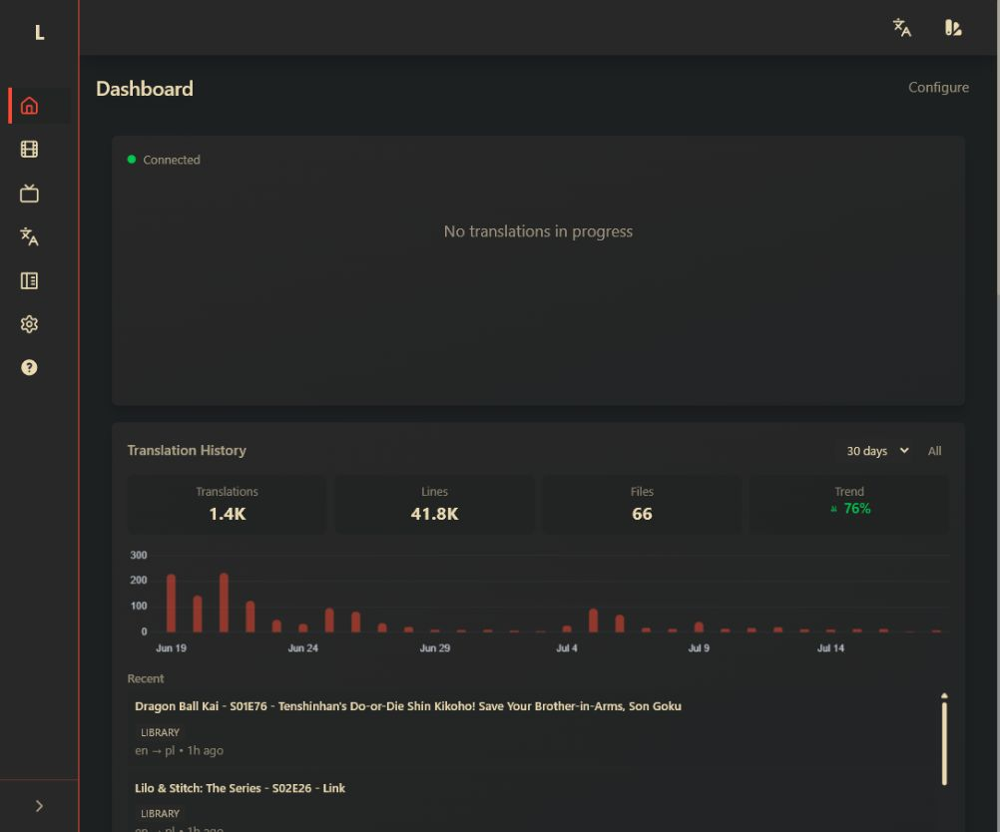
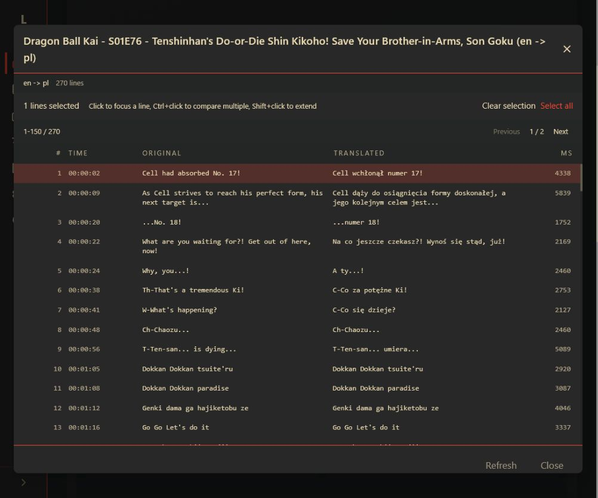
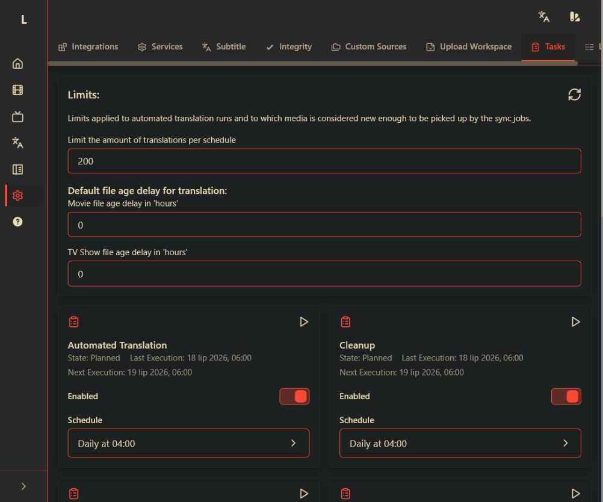
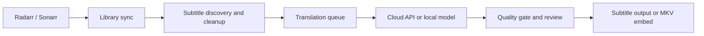

# Lingarr on Steroids

<p align="center">
  <strong>Subtitle translation for real-world Radarr/Sonarr libraries.</strong><br>
  Connect your media library, choose the translation service that fits, and let Lingarr manage the queue, quality checks, and output.
</p>

<p align="center">
  <a href="https://github.com/T9es/lingarr-on-steroids/releases"></a>
  <a href="https://hub.docker.com/r/ree0/lingarr-on-steroids"></a>
  <a href="https://github.com/T9es/lingarr-on-steroids/actions/workflows/ci.yml"></a>
  <a href="LICENSE"></a>
  <a href="https://discord.gg/HkubmH2rcR"></a>
</p>

<p align="center">
  <a href="Readme.MD">English</a> |
  <a href="Readme.de.md">Deutsch</a> |
  <a href="Readme.pl.md">Polski</a> |
  <a href="Readme.nl.md">Nederlands</a> |
  <a href="Readme.fr.md">Français</a> |
  <a href="Readme.es.md">Español</a> |
  <a href="Readme.zh.md">Chinese</a>
</p>

---

## What is Lingarr?

Lingarr on Steroids is a self-hosted subtitle translation service for people who already manage their media with Radarr and Sonarr. It discovers subtitle tracks, sends them through the translation provider you choose, and writes the result back next to the media or into the original container when needed.

This project is a fork of [Lingarr](https://github.com/lingarr-translate/lingarr) focused on the parts that matter once a library becomes large: reliable queues, multiple Radarr/Sonarr instances, subtitle repair, quality review, and operational visibility.

## See it in action

These screenshots come from a local Lingarr instance and show public-safe product surfaces. Integration settings and screens with server details are intentionally excluded so the repository does not publish URLs or API keys. The comparison example uses a recent translated file and contains no infrastructure values or credentials.

<table>
  <tr>
    <td colspan="2"></td>
  </tr>
  <tr>
    <td colspan="2" align="center"><em>Dashboard overview with translation history, library totals, and recent activity</em></td>
  </tr>
  <tr>
    <td colspan="2"></td>
  </tr>
  <tr>
    <td colspan="2" align="center"><em>Open a recent file to compare original and translated subtitle lines</em></td>
  </tr>
  <tr>
    <td colspan="2"></td>
  </tr>
  <tr>
    <td colspan="2" align="center"><em>Per-job schedules, limits, and enable/disable controls</em></td>
  </tr>
</table>

## How it works



1. Connect one or more Radarr and Sonarr instances through the onboarding assistant.
2. Sync the library and let Lingarr find embedded, external, or bitmap subtitle tracks.
3. Configure a cloud provider, self-hosted model, or custom translation source.
4. Queue translations with limits, priorities, retries, and provider-aware backoff.
5. Review quality-gate failures, compare source and translated cues, and accept, reject, or requeue the result.

## Why this fork?

| Area | What Lingarr on Steroids adds |
| --- | --- |
| Queue reliability | Custom translation workers, delayed retries, rate-limit recovery, ghost-job protection, and per-provider circuit breakers. |
| Library scale | Multiple Radarr/Sonarr instances, dashboard history with infinite scroll, and configurable worker limits. |
| Subtitle quality | ASS/SSA cleanup, integrity checks, OCR for bitmap subtitles, deferred repair, and a post-translation quality gate. |
| Review workflow | Side-by-side comparison, inline cue editing, bulk requeue/dismiss actions, and a translation test workspace. |
| Operations | API usage metrics, live SignalR updates, configurable Tasks, structured logs, and 11 built-in themes. |
| Deployment | PostgreSQL-first Docker deployment with SQLite support for smaller installations, plus AMD64 and ARM64 images. |

## What is new in v3.0.0?

Version 3 is a substantial change over v2.5.0. Highlights include:

- Git-aware release versioning and real dev-build versions in the UI.
- CrofAI, NanoGPT, Chutes.ai, and LocalAI integrations with provider-specific usage and quota handling.
- OCR for DVD/VobSub, PGS, and other image-based subtitle tracks.
- Provider circuit breakers and automatic recovery from provider rate limits such as HTTP 429 responses.
- A post-translation quality gate for reviewing, editing, accepting, rejecting, requeueing, or dismissing questionable cues.
- Inline subtitle comparison and editing in the dashboard.
- Auto source-language detection with NLLB, LLM scoring, and language-family heuristics.
- The redesigned Tasks page with per-job enable toggles and cron schedules.
- Configurable MKV embedding, untagged-stream language detection, and request retry limits.
- MKV embed fallback when a translated output path would exceed common filesystem limits.
- Upload Workspace as a tab inside Translations, plus dashboard infinite scroll and an enhanced API usage widget.

See the [CHANGELOG](CHANGELOG.md#migration-notes-for-3x-v300) for the complete release and migration notes.

## Supported services

**AI providers**

- [OpenAI](https://openai.com/) (GPT)
- [Anthropic](https://www.anthropic.com/) (Claude)
- [Google Gemini](https://gemini.google.com/)
- [DeepSeek](https://deepseek.com/)
- [Chutes.ai](https://chutes.ai/) with quota tracking and auto-pause
- [NanoGPT](https://nano-gpt.com/) with subscription usage, reserves, and auto-pause
- [CrofAI](https://crof.ai/) with credits-only usage tracking and auto-pause
- LocalAI / Ollama for self-hosted models

**Cloud translation APIs**

- [LibreTranslate](https://libretranslate.com/)
- [DeepL](https://www.deepl.com/)
- [Google Translate](https://translate.google.com/)
- [Bing Translator](https://www.bing.com/translator)
- [Yandex Translate](https://translate.yandex.com/)
- [Azure Translator](https://www.microsoft.com/en-us/translator/business/translator-api/)

## Getting started

For the full library workflow, you will typically want Docker, Radarr or Sonarr, and credentials for at least one translation provider. PostgreSQL is the recommended database; SQLite is convenient for a small single-user installation.

### Docker image tags

| Tag | Description | Architectures |
| --- | --- | --- |
| `latest` | Latest stable release | `linux/amd64`, `linux/arm64` |
| `1.2.3` | Specific version | `linux/amd64`, `linux/arm64` |
| `main` | Development build | `linux/amd64`, `linux/arm64` |

### PostgreSQL (recommended)

```yaml
services:
  lingarr:
    image: ree0/lingarr-on-steroids:latest
    container_name: lingarr
    environment:
      - TZ=Your/Timezone
      - DB_CONNECTION=postgresql
      - DB_HOST=postgres
      - DB_PORT=5432
      - DB_DATABASE=lingarr
      - DB_USERNAME=lingarr
      - DB_PASSWORD=your_secure_password
    volumes:
      - ./movies:/movies
      - ./tv:/tv
      - ./config:/app/config
    ports:
      - "9876:9876"
    restart: unless-stopped
    depends_on:
      postgres:
        condition: service_healthy

  postgres:
    image: postgres:16-alpine
    environment:
      POSTGRES_DB: lingarr
      POSTGRES_USER: lingarr
      POSTGRES_PASSWORD: your_secure_password
    volumes:
      - postgres_data:/var/lib/postgresql/data
    healthcheck:
      test: ["CMD-SHELL", "pg_isready -U lingarr -d lingarr"]
      interval: 10s
      timeout: 5s
      retries: 5
    restart: unless-stopped

volumes:
  postgres_data:
```

### SQLite (quick start)

```yaml
services:
  lingarr:
    image: ree0/lingarr-on-steroids:latest
    environment:
      - TZ=Your/Timezone
      - DB_CONNECTION=sqlite
      - SQLITE_DB_PATH=lingarr.db
    volumes:
      - ./movies:/movies
      - ./tv:/tv
      - ./config:/app/config
    ports:
      - "9876:9876"
    restart: unless-stopped
```

All images support AMD64 and ARM64, including Raspberry Pi and Apple Silicon deployments.

## Configuration

| Variable | Description | Default |
| --- | --- | --- |
| `TZ` | Container timezone | - |
| `ASPNETCORE_URLS` | HTTP bind address | `http://+:9876` |
| `DB_CONNECTION` | `postgresql` or `sqlite` | `postgresql` |
| `SQLITE_DB_PATH` | SQLite file name inside `/app/config` | `local.db` |
| `DB_HOST` | PostgreSQL host | - |
| `DB_PORT` | PostgreSQL port | `5432` |
| `DB_DATABASE` | Database name | - |
| `DB_USERNAME` | Database username | - |
| `DB_PASSWORD` | Database password | - |
| `MAX_PARALLEL_TRANSLATIONS` | Startup value for custom translation workers | `1` |
| `MAX_CONCURRENT_JOBS` | Hangfire worker count for sync and system queues | `5` |
| `RADARR_URL` | Your Radarr URL | - |
| `RADARR_API_KEY` | Radarr API key | - |
| `SONARR_URL` | Your Sonarr URL | - |
| `SONARR_API_KEY` | Sonarr API key | - |

See [Settings.MD](Settings.MD) for the complete environment reference.

## Detailed behavior

<details>
  <summary>Subtitle processing</summary>

- FFmpeg extracts text subtitles from MKV and MP4 containers when they are embedded.
- ASS/SSA cleanup removes drawing commands, musical markers, placeholder effects, and URLs before translation.
- Sparse tracks with fewer than 50 dialogue entries are skipped.
- External subtitle discovery tracks subtitle files added manually.
- Bitmap subtitle tracks such as DVD/VobSub and PGS can be OCR'd into text before translation.
- ASS integrity checks catch leaked tag fragments before they reach translation prompts.
- Long output paths fall back to embedding the translation into the original MKV.
</details>

<details>
  <summary>Queueing and reliability</summary>

- Translation jobs run through a custom `BackgroundService` with configurable parallel workers.
- Media tracks move through explicit states including `Pending`, `InProgress`, `Complete`, `Stale`, `Failed`, `OcrPending`, and `OcrBlocked`.
- Media priority is honoured so a stalled low-priority request does not block the rest of the queue.
- Provider failures trip a per-provider circuit breaker instead of consuming quota during an outage.
- Provider rate limits pause requests and resume them when the limit clears.
- Exponential backoff, delayed requeue, orphan subtitle cleanup, and ghost-job protection handle common restart and library-change cases.
</details>

<details>
  <summary>UI and operations</summary>

- The onboarding wizard guides first-time Radarr/Sonarr and translation-service setup.
- Dashboard widgets support drag-and-drop layouts and live SignalR updates.
- API usage tracks calls, tokens, latency, errors, and success rate.
- Quality-gate failures can be edited inline, accepted, rejected, requeued, or dismissed in bulk.
- Completed translations can be compared side by side after the batch finishes.
- Tasks exposes per-job schedules, limits, enable toggles, and execution state.
- The client includes 11 built-in themes and translations for English, Dutch, German, French, Spanish, Polish, and Simplified Chinese.
</details>

## Upgrading

> **From v1.x to v2.0.0:** This is a breaking upgrade. MySQL/MariaDB is no longer supported, settings are not migrated automatically, and a clean start is required.

> **From v2.x to v3.0.0:** Read the [migration notes](CHANGELOG.md#migration-notes-for-3x-v300). The Schedule page became Tasks, the onboarding wizard and job scheduling changed, and the quality-gate workflow was expanded.

## Project links

- [CHANGELOG](CHANGELOG.md) — release notes and migrations
- [Settings reference](Settings.MD) — environment variables and deployment options
- [Contributing guide](CONTRIBUTING.md) — development workflow
- [Security policy](SECURITY.md) — responsible disclosure
- [GitHub issues](https://github.com/T9es/lingarr-on-steroids/issues) — bugs, features, and setup questions
- [Discord](https://discord.gg/HkubmH2rcR) — community discussion

## Credits

Original Lingarr by [rowanfuchs](https://github.com/lingarr-translate/lingarr).

Icons: [Lucide](https://lucide.dev/icons).  
Subtitle parsing: [AlexPoint](https://github.com/AlexPoint/SubtitlesParser).  
Translation: LibreTranslate and the GTranslate library.

Thanks to [selfh.st](https://selfh.st/?ref=lingarr), [r/selfhosted](https://www.reddit.com/r/selfhosted/), and [FrankieBBBB](https://github.com/FrankieBBBB).
